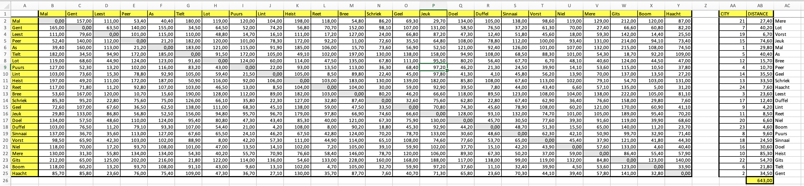

# The Problem

> Description taken from Jeroen Baerts's Github repository(*) that describes the problem and another solution.

In 1999, Belgian songsmith [Sam Gooris](https://nl.wikipedia.org/wiki/Sam_Gooris) rocked the charts with his dance hit [_Ambiance, Ambiance_](https://www.youtube.com/watch?v=EqdQyoAUQZ0).

During the [March 2019 edition](https://soundcloud.com/lieven-scheire/nerdland-maandoverzicht-maart-2019) of the [Nerdland Science Podcast](www.nerdland.be) ([listen at 39:08](https://soundcloud.com/lieven-scheire/nerdland-maandoverzicht-maart-2019#t=39:11)), whilst discussing the news that [amoeba had been successfully used in problem-solving](https://phys.org/news/2018-12-amoeba-approximate-solutions-np-hard-problem.html), we looked at the [lyrics](https://muzikum.eu/en/123-173-5017/sam-gooris/ambiance-lyrics.html) of this song. In his anthem, Mr. Gooris eloquently describes how he visits several Belgian villages and cities in order to engage in rhyming party-related activities. However, the order in which he visits these locations is far from optimal. [Bart Van Peer](https://twitter.com/zebbedeusje) posed the question: **_What if Mr. Gooris could rearrange his travel itinerary (and, subsequently, his lyrics) to allow for an optimal usage of his time and mileage?_**

This is a classic example of a [Traveling Salesman](https://en.wikipedia.org/wiki/Travelling_salesman_problem) problem, a well-known problem in Computer Sciences which is [NP-hard](https://en.wikipedia.org/wiki/NP-hardness), which means that the worst-case running time of any problem-solving technique will increase [superpolynomially](https://en.wikipedia.org/wiki/Time_complexity#Polynomial_time) with the number of cities. In this instance, Mr. Gooris visits 24 locations in the following order, derived from the lyrics:

```
Mal -> Ghent -> Leest -> Peer -> As -> Tielt -> Lot -> Puurs -> Lint -> Heist -> Reet -> Bree -> Schriek -> Geel -> Jeuk (**) -> Doel -> Duffel -> Sinaai -> Vorst -> Niel -> Mere (**) -> Gits -> Boom -> Haacht -> Mal
```

We name this problem TSP, a _Travelling Sam Problem_.

(*) [https://github.com/Forceflow/Ambiance_TSP](https://github.com/Forceflow/Ambiance_TSP)

(**) There's some discussion regarding "Leut" or "Jeuk" and "Bere" and "Mere". I choose the latter in both cases as they sounded more alike to my hearing.

# ~~The~~ A Solution

Since I was using the actual driving distance between two cities, the order in which they are visited, and the startpoint _could_ be relevant.

The distance from A to B could (and actually did sometimes) be different than the distance from B to A, caused by single-direction streets, closed roads etc...

## The Sam Gooris way of traveling

The original order of Sam's trip around Flanders:

```
Mal -> Ghent -> Leest -> Peer -> As -> Tielt -> Lot -> Puurs -> Lint -> Heist -> Reet -> Bree -> Schriek -> Geel -> Jeuk (**) -> Doel -> Duffel -> Sinaai -> Vorst -> Niel -> Mere (**) -> Gits -> Boom -> Haacht -> Mal
```

For a total of 1975,50 km (see solution below)


## Optimized travel route

The solution I came up with is 633,40 km, which saves our precious planet 1300+ km of gasoline.

```
Lint -> Reet -> Niel -> Boom -> Doel -> Sinaai -> Heist -> Gits -> Tielt -> Ghent -> Mere -> Lot -> Vorst -> Puurs -> Jeuk -> Mal -> As -> Bree -> Peer -> Geel -> Schriek -> Haacht -> Leest -> Duffel -> Lint
```


# My Method

## Step 1: Distances

I used Google's DistanceMatrix API to calculate the actual (driving) distance between all cities.

The DistanceMatrix API takes a list of starting points and a list of destinations and calculates all distances between all combinations.

For our problem, the starting points and destinations are the same 24 cities.

For convenience, we output the matrix as an HTML table with the city names as headers.

```(javascript)
function calcDistances() {
  const origins = [
    "Mal, Tongeren, Belgium",
    "Gent, Belgium",
    "Leest, Belgium",
    "Peer, Belgium",
    "As, Belgium",
    "Tielt, Belgium",
    "Lot, Belgium",
    "Puurs, Belgium",
    "Lint, Belgium",
    "Knokke-Heist, Belgium",
    "Reet, Belgium",
    "Bree, Belgium",
    "Schriek, Belgium",
    "Geel, Belgium",
    "Jeuk, Belgium",
    "Doel, Belgium",
    "Duffel, Belgium",
    "Sinnaai, Belgium",
    "Vorst, Belgium",
    "Niel, Belgium",
    "Mere, Belgium",
    "Gits, Belgium",
    "Boom, Belgium",
    "Haacht, Belgium"
  ];
  const destinations = origins;
  const service = new google.maps.DistanceMatrixService();
  service.getDistanceMatrix(
    {
      origins,
      destinations,
      travelMode: "DRIVING",
      avoidTolls: true
    },
    callback
  );

  function callback({ originAddresses, destinationAddresses, rows }, status) {
    if (status == "OK") {
      const origins = originAddresses;
      const destinations = destinationAddresses;
      let output = "<table><tr><th>&nbsp;</th>";
      // FROM:
      for (var i = 0; i < origins.length; i++) {
        output += `<th>${origins[i]}</th>`;
      }
      output += "</tr>";
      for (let i = 0; i < origins.length; i++) {
        const results = rows[i].elements;
        output += `<tr><th>${destinations[i]}</th>`;

        results.forEach(element => {
          const distance = element.distance.text;
          const duration = element.duration.text;
          output += `<td>${distance}</td>`;
        });

        output += "</tr>";
      }
      output += "</table>";
      appendHtml(document.body, output);
    } else {
      console.log("PEUT, der ging iet mis.");
    }
  }
}

function appendHtml(el, str) {
  const div = document.createElement("div");
  div.innerHTML = str;
  while (div.children.length > 0) {
    el.appendChild(div.children[0]);
  }
}
```

Which will give us a table with all distances:


We can easily copy paste this result in Excel to start the optimization.

As you see, Google returns 1m instead of "0" for distances between the same city. A quick "replace all" action in Excel gets rid of these. Same for the "km" suffix, we are only interested in the numbers, since everything is measured in kilometers once we got rid of the "1 m" values.

## Step 2: Shortest route

Once everything is in Excel, we can start creating our optimized version.

We start with the plain data:


First we will create a named variable for all our data. This will come in handy to reference the dataset more easily in our formulas.

You can do so by selecting all values (no header row/columns, only the distances) > right click > Define name > enter a name


Next we will add two columns after this table. 

The first will simply be a list of all numbers from 1 to 24. They will represent the cities.

The second column will calculate the distance between the previous (row above) and the current (this row) city.

Excel has an `INDEX()` formula for this. Start with city #2 (first is a special case to close the loop).

```
=INDEX(CityDistance; AA2; AA3)
```

You can expand this formula to the last row. The first distance is between the last city and the first one, we'll add this manually.


The sum is now 1975,5 km. This is the distance Sam Gooris would travel if he did all activities in order of appearance in the song.

Let's optimize this route for the sake of planet earth!

To solve this, we need the "Solver" add-in from Excel, which is available out of the box, you only need to enable it:

`Tools > Excel Add-ins` 

Check `Solver Add-In` and click OK.


Via the "Data" ribbon, you now have an additional "Solver" functionality.


When we click the "Solver" button, we get an oldschool interface to set our parameters.

We choose the value to optimize (the total distance), the wanted result (minimum value) and the variables the solver should vary. 

We also add a constraint that each value should be unique!


Now let's solve it. This will take some time (depending on the host machine).


One final step is to display the city name next to the distance for the sake of readability.

We can use the `INDEX()` formula again, but need to expand our datasource (can't use the named variable since we did not include header columns).

We will also need to pinpoint values in our dataset, so it does not get auto-incremented if we expand our formula to rows below. We can do this by using dollar signs before the column name and the row index (`=$A$2` will always reference cell A2 if we expand a formula, while `=A2` will become A3, A4, A5... if we expand).

In our sheet this will become

`=INDEX($A$2:$Y$25; AA2; 1)` - In the dataset (A2 - Y25) we take the row with index AA2 and take the first column (the city name in this dataset).


# Final solution



# Bonus

Of course I had to rework the original song based on this new order (***).

Listen to [Sam Gooris - Ambiance, Ambiance (The TSP order)](./music/sam_gooris_-_ambianceambiance_tsp_order.m4a).

Sounds a bit less catchy, but everything for mother nature!

(***) No copyright infringement intended. Original song is copyrighted by Sam Gooris, Frank Dingenen & Koen De Beir.
